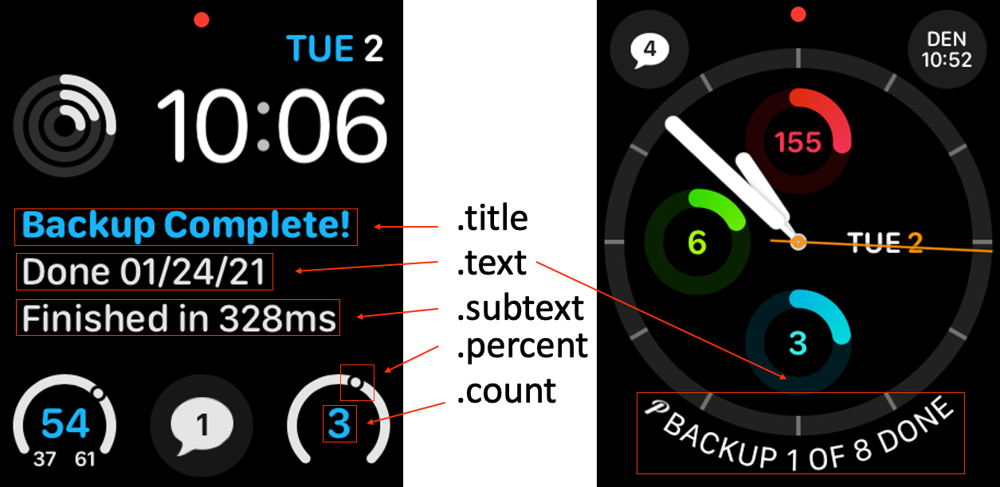

# Pushover Demo #
***
### Using the Pushover App to send notifications ###
This is a brief demo of the Pushover App and its capabilities. The Pushover app can generate both push notifications and update your Apple Watch face if you have one.

>Requirements:
> - Pushover Application
> - Pushover License ($5 one time)
> - Basic understanding of HTTP requests
> - Information that you want to send, of course!

### Getting Started ###
- [ ] Setup your [Pushover Account](https://pushover.net)
- [ ] Create and store your API key
- [ ] Send a `POST` request to `https://api.pushover.net/1/messages.json`
- [ ] In the body of your request, include the required parameters found on [Pushover's API Page](https://pushover.net/api)
***
### Example 1 - Push Notification ###

```javascript
const url = 'https://api.pushover.net/1/messages.json'
const data = {
    token: 'azGDORePK8gMaC0QOYAMyEEuzJnyUi', // Your Pushover API key
    user: 'azGDORePK8gMaC0QOYAMyEEuzJnyUi', // Your userKey from the Pushover app
    title: 'Backup Complete!',
    message: 'Backup of database "transaction_history" was completed successfully.'
}

fetch(url, {
    method: 'POST',
    body: JSON.stringify(data)
})
    .then(data => console.log(data)) //{"status":1,"request":"5135d73e-de3d-4458-b79c-b3b2a9ef6c40"}
    .catch(err => console.log(err)) // {"status":0 "request":"7903bd1b-6aa2-43e6-9c1c-bb5ccea848f1", "errors":[ "application token is invalid" ]}
```
>`token`, `user`, `title`, and `message` are required, but there are many other options you can use. Try setting `{ html: 1 }` or `{ monospace: 1 }` for some additional options!

| Normal | HTML | Monospaced |
|:----:|:----:|:----:|
| | | | 
***

### Example 2 - Watch Glance Update ###
If you have an Apple Watch, Pushover includes the option to display data on your watch face in various ways. This is useful if you need to keep track of information but it's not urgent enough for a push notification.

```javascript
const url = 'https://api.pushover.net/1/glances.json' // <-note the URL change
const data = {
    token: 'azGDORePK8gMaC0QOYAMyEEuzJnyUi', // Your Pushover API key
    user: 'azGDORePK8gMaC0QOYAMyEEuzJnyUi', // Your userKey from the Pushover app
    title: 'Backup Complete!', // Line 1
    text: 'Done 01/24/21', // Line 2
    subtext: 'Finished in 328ms', // Line 3
    count: 3, // Dial inner number
    percent: 58 // Dial outer gauge
}

fetch(url, {
    method: 'POST',
    body: JSON.stringify(data)
})
    .then(data => console.log(data)) // {"status":1,"request":"5135d73e-de3d-4458-b79c-b3b2a9ef6c40"}
    .catch(err => console.log(err)) // {"status":0 "request":"7903bd1b-6aa2-43e6-9c1c-bb5ccea848f1", "errors":[ "application token is invalid" ]}
```

#### Glance Tips and Tricks
- The watch fields are slightly misleading. If you use a multi-line watch complication, you will see all three lines in the order `title`, `text`, `subtext` (see the screenshot below)
- If you're using a watch complication that has only 1 line, the line shown will be whatever is assigned the `text` property
- Some complications show either a dial or a gauge - the `count` parameter controls the number displayed, and the `percent` controls the outder dial
  - Count takes an `integer` (passing in a `float` will not throw error, however _the count will simply not update._ This is a common source of bugs)
  - Percent takes an `integer` or `float` between 0 and 100

### Important: ###
Because of how the Apple Watch manages battery, **_be sure to rate limit your updates to the watch._** A good rule of thumb is no more than once per 20 minutes. If you exceed this limit, the Apple Watch will 'blacklist' your app, and will stop displaying updates until the limit is reset at midnight each day.
| Screenshot 1 | Screenshot 2 |
|:---:|:---:|
|  |  |
***


***